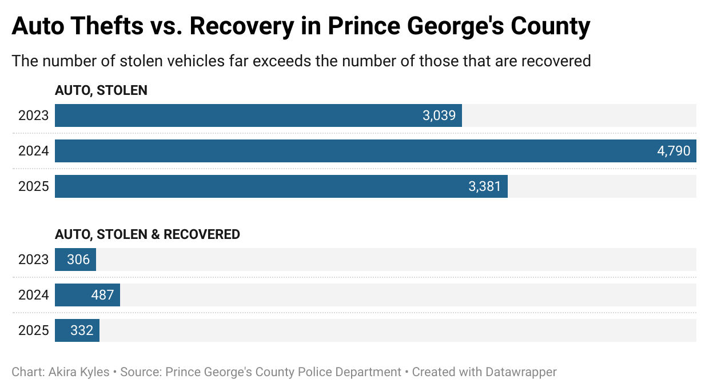

This is a cheat sheet of important codes I found essential to reference throught the duration of the 772 data journalism class.

## Create your website

In place of these instructions, you will copy over your notes from this semester about key R commands and processes that will leave you with a usable cheat sheet. So make a copy of this now and follow the steps.

First, create H1 headers for common tasks such as Data Viz, Building Tables, Cleaning Data, Joins

For example:

# Building a data notebook

# Loading Libraries

```{r echo=TRUE}
# install.packages("htmlwidgets")
# install.packages("leaflet")
#install.packages("sf")
#install.packages('DT')
#install.packages("formattable")
library(DT)
library(tidyverse)
library(rio)
library(janitor)
library(htmlwidgets)
library(leaflet)
library(sf)
library(googlesheets4)
library(formattable)
```

# Reading in Data

```{r}
pg_crime_2325 <- read_csv('data/Crime_Incidents_July_2023_to_Present_20251128.csv') |> 
clean_names()

```

# Exporting Data

```{r}
write.csv(pg_crime_2325, "pg_crime_2325.csv")
```

# Mutating Data & Filtering Data

```{r}
pg_crime_2325 |>
  filter(str_detect(clearance_code_inc_type, "AUTO, STOLEN"))|> 
  mutate(date = as.Date(date, format = "%m/%d/%Y")) |>
  mutate(year = year(date)) |> 
  group_by(year, clearance_code_inc_type) |> 
  summarise(count=n(), .groups = "drop") |> 
  arrange(year)
```

## Filtering Data

```{r}
pg_crime_2325 |>
  filter(str_detect(clearance_code_inc_type, "AUTO, STOLEN"))|> 
  group_by(clearance_code_inc_type, pgpd_sector) |> 
  summarise(count=n()) |> 
  arrange(desc(count))
```

```{r}
pg_crime_2325 |>
  filter(str_detect(clearance_code_inc_type, "THEFT FROM AUTO"))|> 
  group_by(clearance_code_inc_type, pgpd_sector) |> 
  summarise(count=n()) |> 
  arrange(desc(count))
```

# Generating Graphs

```{r}
graph_ex <- pg_crime_2325 |>
  filter(str_detect(clearance_code_inc_type, "AUTO, STOLEN"))|> 
  mutate(date = as.Date(date, format = "%m/%d/%Y")) |>
  mutate(year = year(date)) |> 
  group_by(year, clearance_code_inc_type) |> 
  summarise(count=n(), .groups = "drop") |> 
  arrange(year)
```

```{r}
graph_ex |> 
 ggplot(aes(x = count, y = factor(year), fill = clearance_code_inc_type)) +
  geom_col(position = "dodge") +
  labs(
    title= "Auto Thefts in Prince George's County",
    y = "Year",
    x = "Thefts",
    caption = "source: Prince George's County Police. Graphic by Akira Kyles. 12/7/2025"
     )
```

# Uploading photos




